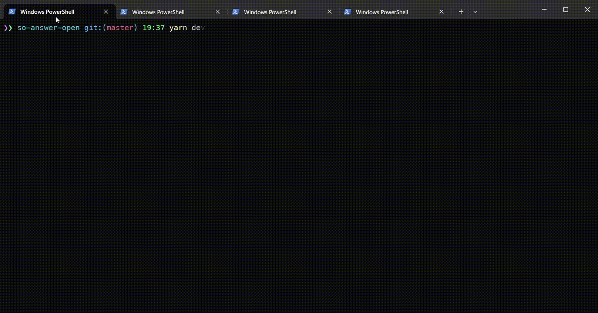

# so-answer-open [![NPM version][npm-image]][npm-url]

> CLI app - Open stackoverflow link by category and key phrase using fuzzy search from registered links

## Install

```bash
$ npm install --global so-answer-open
```

## CLI

```
  Usage
    $ so-answer-open

  Shorthand command aliases:
    $ soanswer
    $ soans
```

## Demos



### Usage

### Using funnier spinners

```bash
  $ so-answer-open
```


## License

MIT © [Rushan Alyautdinov](https://github.com/akgondber)

[npm-image]: https://img.shields.io/npm/v/so-answer-open.svg?style=flat
[npm-url]: https://npmjs.org/package/so-answer-open
